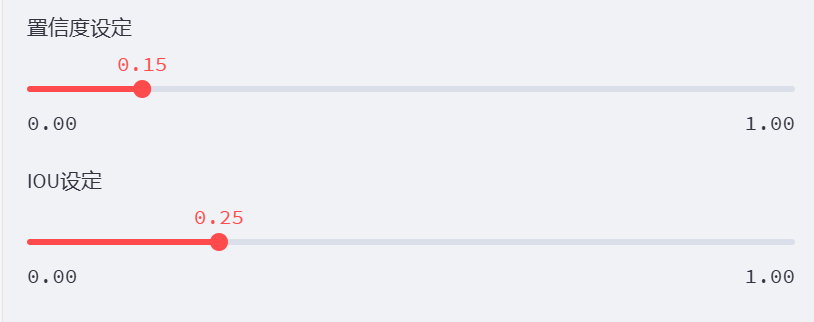

# 个人防护装备分割系统源码＆数据集分享
 [yolov8-seg-C2f-SCcConv＆yolov8-seg-slimneck等50+全套改进创新点发刊_一键训练教程_Web前端展示]

### 1.研究背景与意义

项目参考[ILSVRC ImageNet Large Scale Visual Recognition Challenge](https://gitee.com/YOLOv8_YOLOv11_Segmentation_Studio/projects)

项目来源[AAAI Global Al lnnovation Contest](https://kdocs.cn/l/cszuIiCKVNis)

研究背景与意义

随着工业化进程的加快，个人防护装备（PPE）在保障工人安全、降低职业伤害方面的重要性愈发凸显。PPE的有效使用不仅能保护工人免受物理、化学和生物危害，还能提高工作效率和心理安全感。然而，传统的PPE监测和管理方法往往依赖人工检查，效率低下且容易出现误判。因此，基于计算机视觉技术的自动化PPE检测与分割系统应运而生，成为当前研究的热点之一。

在众多计算机视觉技术中，YOLO（You Only Look Once）系列模型因其高效的实时目标检测能力而备受关注。YOLOv8作为该系列的最新版本，进一步提升了检测精度和速度，尤其在复杂场景下的表现尤为突出。然而，YOLOv8在处理实例分割任务时仍存在一定的局限性，尤其是在细粒度特征提取和小目标检测方面。因此，针对YOLOv8进行改进，以提升其在PPE实例分割任务中的性能，具有重要的研究价值和实际意义。

本研究所使用的数据集包含7100张图像，涵盖了六类PPE物品：靴子、手套、护目镜、安全帽、人员和背心。这一数据集的多样性和丰富性为模型的训练和验证提供了良好的基础。通过对这些图像进行实例分割，可以实现对每种防护装备的精准识别和定位，为后续的自动化监测和管理提供数据支持。此外，数据集中包含的多种类目能够有效提升模型的泛化能力，使其在不同场景下的应用更加广泛。

本研究的意义不仅在于技术层面的创新，更在于其对提升工人安全和职业健康的实际贡献。通过构建一个基于改进YOLOv8的PPE实例分割系统，可以实现对工人佩戴防护装备的实时监测与评估，及时发现未佩戴或佩戴不当的情况，从而减少事故发生的风险。此外，该系统还可以为企业提供数据分析支持，帮助其优化PPE管理流程，提高整体安全管理水平。

综上所述，基于改进YOLOv8的个人防护装备分割系统的研究，不仅推动了计算机视觉技术在工业安全领域的应用，也为实现智能化、自动化的安全管理提供了新的思路和方法。随着相关技术的不断发展和完善，未来有望在更广泛的场景中推广应用，为保护工人安全、促进职业健康做出更大的贡献。

### 2.图片演示


##### 注意：由于此博客编辑较早，上面“2.图片演示”和“3.视频演示”展示的系统图片或者视频可能为老版本，新版本在老版本的基础上升级如下：（实际效果以升级的新版本为准）

  （1）适配了YOLOV8的“目标检测”模型和“实例分割”模型，通过加载相应的权重（.pt）文件即可自适应加载模型。

  （2）支持“图片识别”、“视频识别”、“摄像头实时识别”三种识别模式。

  （3）支持“图片识别”、“视频识别”、“摄像头实时识别”三种识别结果保存导出，解决手动导出（容易卡顿出现爆内存）存在的问题，识别完自动保存结果并导出到tempDir中。

  （4）支持Web前端系统中的标题、背景图等自定义修改，后面提供修改教程。

  另外本项目提供训练的数据集和训练教程,暂不提供权重文件（best.pt）,需要您按照教程进行训练后实现图片演示和Web前端界面演示的效果。

### 3.视频演示

[3.1 视频演示](https://www.bilibili.com/video/BV1ng1GY9Eh6/)

### 4.数据集信息展示

##### 4.1 本项目数据集详细数据（类别数＆类别名）

nc: 6
names: ['Boots', 'Gloves', 'Goggles', 'Helmet', 'Person', 'Vest']


##### 4.2 本项目数据集信息介绍

数据集信息展示

在本研究中，我们使用了名为“PPE Instance Segmentation”的数据集，以训练和改进YOLOv8-seg模型，旨在实现高效的个人防护装备（PPE）分割系统。该数据集专注于识别和分割与个人防护相关的物品，具有广泛的应用潜力，尤其是在工业安全、建筑工地、医疗环境等领域。数据集的设计旨在提供丰富的实例，以便模型能够学习到不同类别的特征，从而提高其在实际应用中的表现。

该数据集包含六个主要类别，分别是：Boots（靴子）、Gloves（手套）、Goggles（护目镜）、Helmet（头盔）、Person（人）和Vest（背心）。这些类别涵盖了个人防护装备的关键组成部分，确保模型能够全面理解和识别在不同场景中可能出现的防护物品。每个类别的样本均经过精心标注，确保数据的准确性和一致性，从而为模型的训练提供可靠的基础。

在数据集的构建过程中，考虑到了多样性和复杂性。每个类别的样本不仅包括不同的颜色、形状和尺寸，还涵盖了各种环境下的使用场景。这种多样性使得模型在训练过程中能够接触到更广泛的特征，从而增强其泛化能力。例如，靴子可能在泥泞的工地、湿滑的地面或干燥的环境中出现，而手套则可能在医疗、工业或实验室等不同场景中被使用。通过引入这些多样化的样本，模型能够学习到更为复杂的特征，从而在实际应用中更好地应对各种情况。

此外，数据集还特别关注人类与个人防护装备之间的关系。在“Person”类别中，数据集不仅标注了人类的轮廓，还强调了他们所穿戴的防护装备。这种设计使得模型能够理解和识别防护装备在实际使用中的重要性，进而提高对防护装备的分割精度。这对于提高工作场所的安全性、减少事故发生率具有重要意义。

在训练过程中，YOLOv8-seg模型将利用该数据集中的丰富信息，通过深度学习算法不断优化其参数，以实现更高的分割精度和更快的处理速度。数据集的多样性和复杂性将为模型提供充足的训练样本，使其能够在面对不同的环境和条件时，依然保持高效的识别和分割能力。

总之，“PPE Instance Segmentation”数据集为本研究提供了坚实的基础，通过其丰富的类别和多样化的样本，助力YOLOv8-seg模型的训练与改进。我们期待通过这一系统的开发，能够在个人防护装备的识别与分割领域取得显著进展，为提升工作场所的安全性贡献力量。


### 5.全套项目环境部署视频教程（零基础手把手教学）

[5.1 环境部署教程链接（零基础手把手教学）](https://www.bilibili.com/video/BV1jG4Ve4E9t/?vd_source=bc9aec86d164b67a7004b996143742dc)


[5.2 安装Python虚拟环境创建和依赖库安装视频教程链接（零基础手把手教学）](https://www.bilibili.com/video/BV1nA4VeYEze/?vd_source=bc9aec86d164b67a7004b996143742dc)

### 6.手把手YOLOV8-seg训练视频教程（零基础小白有手就能学会）

[6.1 手把手YOLOV8-seg训练视频教程（零基础小白有手就能学会）](https://www.bilibili.com/video/BV1cA4VeYETe/?vd_source=bc9aec86d164b67a7004b996143742dc)


按照上面的训练视频教程链接加载项目提供的数据集，运行train.py即可开始训练



     Epoch   gpu_mem       box       obj       cls    labels  img_size
     1/200     0G   0.01576   0.01955  0.007536        22      1280: 100%|██████████| 849/849 [14:42<00:00,  1.04s/it]
               Class     Images     Labels          P          R     mAP@.5 mAP@.5:.95: 100%|██████████| 213/213 [01:14<00:00,  2.87it/s]
                 all       3395      17314      0.994      0.957      0.0957      0.0843

     Epoch   gpu_mem       box       obj       cls    labels  img_size
     2/200     0G   0.01578   0.01923  0.007006        22      1280: 100%|██████████| 849/849 [14:44<00:00,  1.04s/it]
               Class     Images     Labels          P          R     mAP@.5 mAP@.5:.95: 100%|██████████| 213/213 [01:12<00:00,  2.95it/s]
                 all       3395      17314      0.996      0.956      0.0957      0.0845

     Epoch   gpu_mem       box       obj       cls    labels  img_size
     3/200     0G   0.01561    0.0191  0.006895        27      1280: 100%|██████████| 849/849 [10:56<00:00,  1.29it/s]
               Class     Images     Labels          P          R     mAP@.5 mAP@.5:.95: 100%|███████   | 187/213 [00:52<00:00,  4.04it/s]
                 all       3395      17314      0.996      0.957      0.0957      0.0845


### 7.50+种全套YOLOV8-seg创新点代码加载调参视频教程（一键加载写好的改进模型的配置文件）

[7.1 50+种全套YOLOV8-seg创新点代码加载调参视频教程（一键加载写好的改进模型的配置文件）](https://www.bilibili.com/video/BV1Hw4VePEXv/?vd_source=bc9aec86d164b67a7004b996143742dc)

### 8.YOLOV8-seg图像分割算法原理

原始YOLOV8-seg算法原理

YOLOV8-seg算法是YOLO系列中的最新版本，结合了目标检测与语义分割的特性，旨在提升在复杂环境下的目标识别与分割能力。该算法在YOLOv8的基础上进行了多项改进，特别是在处理小目标和复杂背景方面表现出色。与传统的anchor-based检测方法相比，YOLOV8-seg采用了anchor-free的策略，这一转变使得模型在检测精度和速度上都有了显著提升。YOLOV8-seg的设计理念在于通过高效的特征提取和上下文信息的保留，来增强模型对小目标的感知能力。

YOLOV8-seg的网络结构主要由输入端、主干网络、Neck端和输出端四个部分组成。输入端负责对输入图像进行预处理，包括Mosaic数据增强、自适应图片缩放和灰度填充等，这些步骤有助于提高模型的鲁棒性和泛化能力。主干网络采用了改进的C2f模块，结合了BiFormer双层路由注意力机制，能够有效捕获远程依赖关系，保留更细粒度的上下文信息。这一设计使得YOLOV8-seg在特征提取过程中能够更好地理解图像中的复杂结构，尤其是在水面等复杂环境中。

在Neck端，YOLOV8-seg引入了路径聚合网络（PAN）结构，通过上采样和下采样的方式对不同尺度的特征图进行融合。这一过程不仅增强了网络对不同大小目标的特征提取能力，还提高了模型在复杂背景下的表现。Neck端的设计使得模型能够在多尺度上有效地处理特征信息，从而提升了整体的检测精度。

输出端则采用了解耦头结构，分类和回归过程被有效分离。这一设计使得YOLOV8-seg在进行目标检测时，能够更灵活地处理正负样本的匹配与损失计算。具体而言，分类损失采用了二元交叉熵损失（BCE），而回归损失则结合了分布焦点损失（DFL）和完全交并比损失（CIoU），从而提升了模型对边界框预测的精准性。

YOLOV8-seg在小目标检测方面的表现尤为突出。针对小目标漏检的问题，算法特别添加了一个更小的检测头，以提升网络对小目标的感知力。这一小检测头的引入，使得模型在处理水面漂浮物等小目标时，能够显著降低漏检率。此外，在Neck端引入的GSConv和Slim-neck技术，不仅保持了检测精度，还有效降低了计算量，使得模型在保持高效性的同时，能够处理更复杂的场景。

为了进一步提升模型的泛化能力和精准度，YOLOV8-seg采用了MPDIoU损失函数替代了传统的CIoU损失函数。MPDIoU损失函数通过考虑目标框的重叠程度、中心点距离以及长宽比等多种因素，能够更全面地评估预测框与真实框之间的差异，从而提升模型的定位精度。

总的来说，YOLOV8-seg算法在设计上充分考虑了复杂环境下的挑战，通过引入先进的特征提取模块、改进的损失函数以及灵活的网络结构，使得模型在目标检测与分割任务中表现出色。其在处理小目标和复杂背景方面的能力，尤其适用于水面等特定场景，为相关领域的应用提供了强有力的技术支持。通过这些创新，YOLOV8-seg不仅继承了YOLO系列的优良传统，还在性能上实现了质的飞跃，展现了其在未来目标检测与分割领域的广阔前景。


### 9.系统功能展示（检测对象为举例，实际内容以本项目数据集为准）

图9.1.系统支持检测结果表格显示

  图9.2.系统支持置信度和IOU阈值手动调节

  图9.3.系统支持自定义加载权重文件best.pt(需要你通过步骤5中训练获得)

  图9.4.系统支持摄像头实时识别

  图9.5.系统支持图片识别

  图9.6.系统支持视频识别

  图9.7.系统支持识别结果文件自动保存

  图9.8.系统支持Excel导出检测结果数据





### 10.50+种全套YOLOV8-seg创新点原理讲解（非科班也可以轻松写刊发刊，V11版本正在科研待更新）

#### 10.1 由于篇幅限制，每个创新点的具体原理讲解就不一一展开，具体见下列网址中的创新点对应子项目的技术原理博客网址【Blog】：


[10.1 50+种全套YOLOV8-seg创新点原理讲解链接](https://gitee.com/qunmasj/good)

#### 10.2 部分改进模块原理讲解(完整的改进原理见上图和技术博客链接)【如果此小节的图加载失败可以通过CSDN或者Github搜索该博客的标题访问原始博客，原始博客图片显示正常】

### YOLOv8简介
YOLOv8是一种目标检测模型，是基于YOLO (You Only Look Once)系列算法发展而来的最新版本。它的核心思想是将目标检测任务转化为一个回归问题，通过单次前向传播即可直接预测出图像中的多个目标的位置和类别。
YOLOv8的网络结构采用了Darknet作为其主干网络，主要由卷积层和池化层构成。与之前的版本相比，YOLOv8在网络结构上进行了改进，引入了更多的卷积层和残差模块，以提高模型的准确性和鲁棒性。
YOLOv8采用了一种特征金字塔网络(Feature Pyramid Network,FPN)的结构，通过在不同层级上融合多尺度的特征信息，可以对不同尺度的目标进行有效的检测。此外，YOLOv8还引入了一种自适应感知域(Adaptive Anchors
的机制，通过自适应地学习目标的尺度和
长宽比，提高了模型对于不同尺度和形状目标的检测效果。
总体来说，YOLOv8结构模型综合了多个先进的目标检测技术，在保证检测速度的同时提升了检测精度和鲁棒性，被广泛应用于实时目标检测任务中。


#### yolov8网络模型结构图

YOLOv8 (You Only Look Once version 8)是一种目标检测算法，它在实时场景下可以快速准确地检测图像中的目标。
YOLOv8的网络模型结构基于Darknet框架，由一系列卷积层、池化层和全连接层组成。主要包含以下几个组件:
1.输入层:接收输入图像。
2.卷积层:使用不同尺寸的卷积核来提取图像特征。
3.残差块(Residual blocks):通过使用跳跃连接(skip connections）来解决梯度消失问题，使得网络更容易训练。
4.上采样层(Upsample layers):通过插值操作将特征图的尺寸放大，以便在不同尺度上进行目标检测。
5.池化层:用于减小特征图的尺寸，同时保留重要的特征。
6.1x1卷积层:用于降低通道数，减少网络参数量。
7.3x3卷积层:用于进—步提取和组合特征。
8.全连接层:用于最后的目标分类和定位。
YOLOv8的网络结构采用了多个不同尺度的特征图来检测不同大小的目标，从而提高了目标检测的准确性和多尺度性能。
请注意，YOLOv8网络模型结构图的具体细节可能因YOLO版本和实现方式而有所不同。


#### yolov8模型结构
YOLOv8模型是一种目标检测模型，其结构是基于YOLOv3模型进行改进的。模型结构可以分为主干网络和检测头两个部分。
主干网络是一种由Darknet-53构成的卷积神经网络。Darknet-53是一个经过多层卷积和残差连接构建起来的深度神经网络。它能够提取图像的特征信息，并将这些信息传递给检测头。
检测头是YOLOv8的关键部分，它负责在图像中定位和识别目标。检测头由一系列卷积层和全连接层组成。在每个检测头中，会生成一组锚框，并针对每个锚框预测目标的类别和位置信息。
YOLOv8模型使用了预训练的权重，其中在COCO数据集上进行了训练。这意味着该模型已经通过大规模数据集的学习，具有一定的目标检测能力。

### RT-DETR骨干网络HGNetv2简介
#### RT-DETR横空出世
前几天被百度的RT-DETR刷屏，参考该博客提出的目标检测新范式对原始DETR的网络结构进行了调整和优化，以提高计算速度和减小模型大小。这包括使用更轻量级的基础网络和调整Transformer结构。并且，摒弃了nms处理的detr结构与传统的物体检测方法相比，不仅训练是端到端的，检测也能端到端，这意味着整个网络在训练过程中一起进行优化，推理过程不需要昂贵的后处理代价，这有助于提高模型的泛化能力和性能。


当然，人们对RT-DETR之所以产生浓厚的兴趣，我觉得大概率还是对YOLO系列审美疲劳了，就算是出到了YOLO10086，我还是只想用YOLOv5和YOLOv7的框架来魔改做业务。。

#### 初识HGNet
看到RT-DETR的性能指标，发现指标最好的两个模型backbone都是用的HGNetv2，毫无疑问，和当时的picodet一样，骨干都是使用百度自家的网络。初识HGNet的时候，当时是参加了第四届百度网盘图像处理大赛，文档图像方向识别专题赛道，简单来说，就是使用分类网络对一些文档截图或者图片进行方向角度分类。


当时的方案并没有那么快定型，通常是打榜过程发现哪个网络性能好就使用哪个网络做魔改，而且木有显卡，只能蹭Ai Studio的平台，不过v100一天8小时的实验时间有点短，这也注定了大模型用不了。 

流水的模型，铁打的炼丹人，最后发现HGNet-tiny各方面指标都很符合我们的预期，后面就一直围绕它魔改。当然，比赛打榜是目的，学习才是享受过程，当时看到效果还可以，便开始折腾起了HGNet的网络架构，我们可以看到，PP-HGNet 针对 GPU 设备，对目前 GPU 友好的网络做了分析和归纳，尽可能多的使用 3x3 标准卷积（计算密度最高），PP-HGNet是由多个HG-Block组成，细节如下：


ConvBNAct是啥？简单聊一聊，就是Conv+BN+Act，CV Man应该最熟悉不过了：
```python
class ConvBNAct(TheseusLayer):
    def __init__(self,
                 in_channels,
                 out_channels,
                 kernel_size,
                 stride,
                 groups=1,
                 use_act=True):
        super().__init__()
        self.use_act = use_act
        self.conv = Conv2D(
            in_channels,
            out_channels,
            kernel_size,
            stride,
            padding=(kernel_size - 1) // 2,
            groups=groups,
            bias_attr=False)
        self.bn = BatchNorm2D(
            out_channels,
            weight_attr=ParamAttr(regularizer=L2Decay(0.0)),
            bias_attr=ParamAttr(regularizer=L2Decay(0.0)))
        if self.use_act:
            self.act = ReLU()
 
    def forward(self, x):
        x = self.conv(x)
        x = self.bn(x)
        if self.use_act:
            x = self.act(x)
        return x 
```
且标准卷积的数量随层数深度增加而增多，从而得到一个有利于 GPU 推理的骨干网络，同样速度下，精度也超越其他 CNN ，性价比也优于ViT-base模型。


另外，我们可以看到：

PP-HGNet 的第一层由channel为96的Stem模块构成，目的是为了减少参数量和计算量。PP-HGNet

Tiny的整体结构由四个HG Stage构成，而每个HG Stage主要由包含大量标准卷积的HG Block构成。

PP-HGNet的第三到第五层使用了使用了可学习的下采样层（LDS Layer），该层group为输入通道数，可达到降参降计算量的作用，且Tiny模型仅包含三个LDS Layer，并不会对GPU的利用率造成较大影响.

PP-HGNet的激活函数为Relu，常数级操作可保证该模型在硬件上的推理速度。

### 11.项目核心源码讲解（再也不用担心看不懂代码逻辑）

#### 11.1 ultralytics\hub\session.py

以下是对代码中最核心部分的提取和详细注释：

```python
import signal
import sys
from pathlib import Path
from time import sleep
import requests
from ultralytics.hub.utils import HUB_API_ROOT, HUB_WEB_ROOT, smart_request
from ultralytics.utils import LOGGER, __version__, checks, is_colab
from ultralytics.utils.errors import HUBModelError

AGENT_NAME = f'python-{__version__}-colab' if is_colab() else f'python-{__version__}-local'

class HUBTrainingSession:
    """
    HUB训练会话类，用于Ultralytics HUB YOLO模型的初始化、心跳监测和检查点上传。
    """

    def __init__(self, url):
        """
        初始化HUBTrainingSession，使用提供的模型标识符。

        Args:
            url (str): 用于初始化HUB训练会话的模型标识符。

        Raises:
            ValueError: 如果提供的模型标识符无效。
            ConnectionError: 如果连接全局API密钥不被支持。
        """
        from ultralytics.hub.auth import Auth

        # 解析输入的URL
        if url.startswith(f'{HUB_WEB_ROOT}/models/'):
            url = url.split(f'{HUB_WEB_ROOT}/models/')[-1]
        if [len(x) for x in url.split('_')] == [42, 20]:
            key, model_id = url.split('_')
        elif len(url) == 20:
            key, model_id = '', url
        else:
            raise HUBModelError(f"model='{url}' not found. Check format is correct.")

        # 授权
        auth = Auth(key)
        self.model_id = model_id
        self.model_url = f'{HUB_WEB_ROOT}/models/{model_id}'
        self.api_url = f'{HUB_API_ROOT}/v1/models/{model_id}'
        self.auth_header = auth.get_auth_header()
        self.alive = True
        self._start_heartbeat()  # 启动心跳监测
        self._register_signal_handlers()  # 注册信号处理器
        LOGGER.info(f'查看模型在 {self.model_url} 🚀')

    def _register_signal_handlers(self):
        """注册信号处理器以优雅地处理终止信号。"""
        signal.signal(signal.SIGTERM, self._handle_signal)
        signal.signal(signal.SIGINT, self._handle_signal)

    def _handle_signal(self, signum, frame):
        """
        处理终止信号，防止在Colab中终止后发送心跳。

        Args:
            signum: 信号编号。
            frame: 当前的栈帧（未使用）。
        """
        if self.alive:
            LOGGER.info('收到终止信号! ❌')
            self._stop_heartbeat()  # 停止心跳
            sys.exit(signum)

    def _stop_heartbeat(self):
        """终止心跳循环。"""
        self.alive = False

    def upload_metrics(self):
        """上传模型指标到Ultralytics HUB。"""
        payload = {'metrics': self.metrics_queue.copy(), 'type': 'metrics'}
        smart_request('post', self.api_url, json=payload, headers=self.auth_header)

    def _get_model(self):
        """从Ultralytics HUB获取并返回模型数据。"""
        api_url = f'{HUB_API_ROOT}/v1/models/{self.model_id}'
        try:
            response = smart_request('get', api_url, headers=self.auth_header)
            data = response.json().get('data', None)

            if data.get('status') == 'trained':
                raise ValueError('模型已训练并上传。')

            if not data.get('data'):
                raise ValueError('数据集可能仍在处理，请稍后再试。')

            self.model_id = data['id']
            return data
        except requests.exceptions.ConnectionError as e:
            raise ConnectionRefusedError('错误: HUB服务器未在线，请稍后再试。') from e

    @threaded
    def _start_heartbeat(self):
        """开始一个线程心跳循环，向Ultralytics HUB报告代理状态。"""
        while self.alive:
            r = smart_request('post',
                              f'{HUB_API_ROOT}/v1/agent/heartbeat/models/{self.model_id}',
                              json={'agent': AGENT_NAME},
                              headers=self.auth_header)
            sleep(300)  # 每300秒发送一次心跳
```

### 核心部分说明：
1. **HUBTrainingSession类**：这是整个训练会话的核心类，负责管理与Ultralytics HUB的交互。
2. **初始化方法**：解析模型标识符，进行授权，并启动心跳监测。
3. **信号处理**：注册信号处理器，以便在接收到终止信号时能够优雅地停止心跳监测。
4. **上传指标**：提供上传模型指标的功能。
5. **获取模型**：从HUB获取模型数据，处理模型状态。
6. **心跳监测**：定期向HUB发送心跳，保持会话活跃。

以上代码是Ultralytics YOLO模型与HUB交互的基础，确保了模型训练过程中的数据上传和状态监测。

这个文件是Ultralytics YOLO模型的一个训练会话管理类，主要用于处理与Ultralytics HUB的交互，包括模型的初始化、心跳信号的发送和检查点的上传等功能。

在文件的开头，导入了一些必要的库和模块，包括信号处理、系统操作、路径处理、时间控制以及HTTP请求等。然后，定义了一个常量`AGENT_NAME`，用于标识当前的Python版本和运行环境（如Colab或本地）。

接下来，定义了`HUBTrainingSession`类，该类的构造函数`__init__`接收一个模型标识符`url`，并根据该标识符进行模型的初始化。在初始化过程中，首先解析输入的URL，如果格式不正确，则抛出`HUBModelError`异常。然后，通过`Auth`类进行身份验证，设置了一些与模型相关的属性，如`model_id`、`model_url`、`api_url`等。此外，还定义了一些速率限制和计时器，用于控制API调用的频率，并调用`_get_model`方法从Ultralytics HUB获取模型数据。

`_register_signal_handlers`方法用于注册信号处理器，以便在接收到终止信号时能够优雅地处理程序的退出。`_handle_signal`方法则在接收到信号时停止心跳循环并退出程序。

`upload_metrics`方法用于将模型的性能指标上传到Ultralytics HUB。`_get_model`方法负责从HUB获取模型数据，并根据模型的状态（如新模型、正在训练的模型等）设置训练参数。

`upload_model`方法用于将模型的检查点上传到Ultralytics HUB，支持上传当前的权重文件以及指示当前模型是否为最佳模型或最终模型的标志。

最后，`_start_heartbeat`方法是一个线程函数，用于定期向Ultralytics HUB发送心跳信号，报告代理的状态。这个方法会在一个循环中持续运行，直到`alive`属性被设置为`False`，以此来保持与HUB的连接并更新状态。

整体而言，这个文件实现了与Ultralytics HUB的交互功能，确保在训练过程中能够及时上传模型的状态和性能指标，同时处理终止信号以保证程序的正常退出。

#### 11.2 ultralytics\utils\autobatch.py

以下是代码中最核心的部分，并附上详细的中文注释：

```python
import numpy as np
import torch
from ultralytics.utils import LOGGER, colorstr
from ultralytics.utils.torch_utils import profile

def check_train_batch_size(model, imgsz=640, amp=True):
    """
    检查YOLO训练的最佳批处理大小。

    参数:
        model (torch.nn.Module): 要检查批处理大小的YOLO模型。
        imgsz (int): 用于训练的图像大小。
        amp (bool): 如果为True，则在训练中使用自动混合精度（AMP）。

    返回:
        (int): 使用autobatch()函数计算的最佳批处理大小。
    """
    with torch.cuda.amp.autocast(amp):
        return autobatch(deepcopy(model).train(), imgsz)  # 计算最佳批处理大小

def autobatch(model, imgsz=640, fraction=0.60, batch_size=16):
    """
    自动估计YOLO模型的最佳批处理大小，以使用可用CUDA内存的一部分。

    参数:
        model (torch.nn.Module): 要计算批处理大小的YOLO模型。
        imgsz (int, optional): 用作YOLO模型输入的图像大小。默认为640。
        fraction (float, optional): 要使用的可用CUDA内存的比例。默认为0.60。
        batch_size (int, optional): 如果检测到错误时使用的默认批处理大小。默认为16。

    返回:
        (int): 最佳批处理大小。
    """
    
    # 检查设备
    prefix = colorstr('AutoBatch: ')
    LOGGER.info(f'{prefix}计算图像大小为{imgsz}的最佳批处理大小')
    device = next(model.parameters()).device  # 获取模型设备
    if device.type == 'cpu':
        LOGGER.info(f'{prefix}未检测到CUDA，使用默认CPU批处理大小 {batch_size}')
        return batch_size
    if torch.backends.cudnn.benchmark:
        LOGGER.info(f'{prefix} ⚠️ 需要torch.backends.cudnn.benchmark=False，使用默认批处理大小 {batch_size}')
        return batch_size

    # 检查CUDA内存
    gb = 1 << 30  # 字节转GiB (1024 ** 3)
    properties = torch.cuda.get_device_properties(device)  # 获取设备属性
    t = properties.total_memory / gb  # 总内存（GiB）
    r = torch.cuda.memory_reserved(device) / gb  # 保留内存（GiB）
    a = torch.cuda.memory_allocated(device) / gb  # 已分配内存（GiB）
    f = t - (r + a)  # 可用内存（GiB）
    LOGGER.info(f'{prefix}{device} ({properties.name}) {t:.2f}G 总, {r:.2f}G 保留, {a:.2f}G 已分配, {f:.2f}G 可用')

    # 评估批处理大小
    batch_sizes = [1, 2, 4, 8, 16]  # 可能的批处理大小
    try:
        img = [torch.empty(b, 3, imgsz, imgsz) for b in batch_sizes]  # 创建空图像张量
        results = profile(img, model, n=3, device=device)  # 评估模型性能

        # 拟合解决方案
        y = [x[2] for x in results if x]  # 提取内存使用情况
        p = np.polyfit(batch_sizes[:len(y)], y, deg=1)  # 一次多项式拟合
        b = int((f * fraction - p[1]) / p[0])  # 计算最佳批处理大小
        if None in results:  # 如果某些大小失败
            i = results.index(None)  # 找到第一个失败的索引
            if b >= batch_sizes[i]:  # 如果最佳大小超过失败点
                b = batch_sizes[max(i - 1, 0)]  # 选择之前的安全点
        if b < 1 or b > 1024:  # 如果最佳大小超出安全范围
            b = batch_size
            LOGGER.info(f'{prefix}警告 ⚠️ 检测到CUDA异常，使用默认批处理大小 {batch_size}.')

        fraction = (np.polyval(p, b) + r + a) / t  # 计算实际使用的内存比例
        LOGGER.info(f'{prefix}使用批处理大小 {b}，可用内存 {t * fraction:.2f}G/{t:.2f}G ({fraction * 100:.0f}%) ✅')
        return b
    except Exception as e:
        LOGGER.warning(f'{prefix}警告 ⚠️ 检测到错误: {e}, 使用默认批处理大小 {batch_size}.')
        return batch_size
```

### 代码说明：
1. **check_train_batch_size** 函数用于检查YOLO模型的最佳训练批处理大小。它会使用 `autobatch` 函数来计算。
2. **autobatch** 函数自动估计最佳批处理大小，以使用可用CUDA内存的一部分。它首先检查设备类型和CUDA内存，然后评估不同批处理大小的内存使用情况，最后通过线性拟合来确定最佳批处理大小。
3. 代码中包含了对CUDA内存的详细检查和日志记录，以便在运行时能够监控内存的使用情况和潜在问题。

这个程序文件的主要功能是自动估算在使用PyTorch进行YOLO模型训练时，最佳的批处理大小（batch size），以便有效利用可用的CUDA内存。程序首先导入了一些必要的库和模块，包括深拷贝、NumPy和PyTorch等。

在文件中定义了两个主要的函数：`check_train_batch_size`和`autobatch`。`check_train_batch_size`函数用于检查给定YOLO模型的训练批处理大小。它接受三个参数：模型、图像大小（默认为640）和一个布尔值（amp），指示是否使用自动混合精度。该函数会在上下文管理器中使用`torch.cuda.amp.autocast`来确保在计算批处理大小时使用混合精度，然后调用`autobatch`函数来计算最佳的批处理大小。

`autobatch`函数是核心功能所在，它会自动估算最佳的批处理大小。该函数接受四个参数：模型、图像大小、可用CUDA内存的使用比例（默认为0.60）和默认批处理大小（默认为16）。首先，它会检查模型所在的设备，如果是CPU，则直接返回默认的批处理大小。如果CUDA未检测到，或者cudnn的benchmark模式开启，也会返回默认的批处理大小。

接下来，函数会检查CUDA内存的使用情况，包括总内存、保留内存、已分配内存和可用内存，并将这些信息记录到日志中。然后，程序会定义一个批处理大小的列表（1, 2, 4, 8, 16），并尝试创建相应大小的空张量以进行性能分析。通过调用`profile`函数来测量不同批处理大小下的内存使用情况，并进行线性拟合以找到最佳的批处理大小。

如果在处理过程中出现错误，程序会捕获异常并记录警告，同时返回默认的批处理大小。如果计算出的批处理大小不在安全范围内（小于1或大于1024），也会返回默认的批处理大小。最后，程序会记录所使用的批处理大小和内存使用情况，并返回最佳的批处理大小。

总体来说，这个文件的目的是帮助用户在训练YOLO模型时，自动选择一个合适的批处理大小，以优化内存使用和训练效率。

#### 11.3 ultralytics\utils\callbacks\base.py

以下是经过简化和注释的核心代码部分，主要保留了回调函数和默认回调字典的定义。

```python
# Ultralytics YOLO 🚀, AGPL-3.0 license
"""基础回调函数定义。"""

from collections import defaultdict
from copy import deepcopy

# 训练器回调函数定义 --------------------------------------------------------------------------------------------

def on_train_start(trainer):
    """训练开始时调用的回调函数。"""
    pass

def on_train_epoch_end(trainer):
    """每个训练周期结束时调用的回调函数。"""
    pass

def on_train_end(trainer):
    """训练结束时调用的回调函数。"""
    pass

# 默认回调字典，包含所有定义的回调函数 ------------------------------------------------------------

default_callbacks = {
    'on_train_start': [on_train_start],  # 训练开始时的回调
    'on_train_epoch_end': [on_train_epoch_end],  # 训练周期结束时的回调
    'on_train_end': [on_train_end],  # 训练结束时的回调
}

def get_default_callbacks():
    """
    返回一个包含默认回调的字典，字典的值为默认空列表。

    返回:
        (defaultdict): 一个带有默认值为空列表的defaultdict。
    """
    return defaultdict(list, deepcopy(default_callbacks))

def add_integration_callbacks(instance):
    """
    将来自不同来源的集成回调添加到实例的回调中。

    参数:
        instance (Trainer, Predictor, Validator, Exporter): 一个具有'callbacks'属性的对象，该属性是一个回调列表的字典。
    """
    # 加载HUB回调
    from .hub import callbacks as hub_cb
    callbacks_list = [hub_cb]

    # 如果实例是Trainer类，则加载训练回调
    if 'Trainer' in instance.__class__.__name__:
        from .clearml import callbacks as clear_cb
        # 其他回调加载...
        callbacks_list.extend([clear_cb])  # 这里可以添加更多的回调

    # 将回调添加到回调字典中
    for callbacks in callbacks_list:
        for k, v in callbacks.items():
            if v not in instance.callbacks[k]:
                instance.callbacks[k].append(v)  # 确保不重复添加回调
```

### 代码说明：
1. **回调函数**：定义了一些核心的回调函数，例如训练开始、训练周期结束和训练结束时的回调。这些函数在特定的训练阶段被调用，可以用于记录日志、调整学习率等操作。
  
2. **默认回调字典**：`default_callbacks` 字典中存储了所有的回调函数，便于在训练过程中统一管理和调用。

3. **获取默认回调**：`get_default_callbacks` 函数返回一个包含默认回调的字典，使用 `defaultdict` 确保在访问不存在的键时返回空列表。

4. **添加集成回调**：`add_integration_callbacks` 函数用于将来自不同模块的回调集成到给定实例的回调字典中，确保不同来源的回调可以在训练过程中被调用。

这个程序文件 `ultralytics/utils/callbacks/base.py` 定义了一系列回调函数，这些函数在训练、验证、预测和导出模型的不同阶段被调用。回调函数是一种在特定事件发生时执行的函数，可以帮助用户在训练过程中插入自定义逻辑或监控模型的状态。

文件首先导入了 `defaultdict` 和 `deepcopy`，这两个模块分别用于创建具有默认值的字典和深拷贝对象。接下来，文件中定义了一系列与训练相关的回调函数，例如 `on_train_start`、`on_train_epoch_start`、`on_train_batch_start` 等。这些函数在训练的不同阶段被调用，允许开发者在这些关键时刻插入自定义代码。

例如，`on_train_start` 函数在训练开始时被调用，而 `on_train_epoch_end` 函数则在每个训练周期结束时被调用。类似的，文件中还定义了与验证、预测和导出相关的回调函数，分别以 `on_val_*`、`on_predict_*` 和 `on_export_*` 开头。

此外，文件中还定义了一个 `default_callbacks` 字典，它将每个回调函数映射到一个列表中，方便后续调用。这个字典组织了所有的回调函数，使得在训练、验证、预测和导出过程中能够方便地访问和执行这些回调。

`get_default_callbacks` 函数返回一个深拷贝的 `default_callbacks` 字典，确保返回的字典是一个新的对象，避免对原始字典的修改。

`add_integration_callbacks` 函数则用于将来自不同来源的集成回调添加到给定实例的回调字典中。这个函数会根据实例的类型（如 Trainer、Predictor、Validator、Exporter）加载相应的回调，并将它们添加到实例的回调列表中。这种设计使得用户可以轻松扩展回调功能，集成第三方工具或库的回调。

总体来说，这个文件提供了一种灵活的机制来管理和扩展模型训练和评估过程中的回调函数，使得用户能够在关键时刻插入自定义逻辑，增强模型训练的可控性和可监控性。

#### 11.4 ultralytics\nn\backbone\VanillaNet.py

以下是代码中最核心的部分，并附上详细的中文注释：

```python
import torch
import torch.nn as nn
import torch.nn.functional as F
from timm.layers import weight_init

# 定义激活函数类，继承自ReLU
class activation(nn.ReLU):
    def __init__(self, dim, act_num=3, deploy=False):
        super(activation, self).__init__()
        self.deploy = deploy  # 是否处于部署模式
        # 初始化权重和偏置
        self.weight = torch.nn.Parameter(torch.randn(dim, 1, act_num*2 + 1, act_num*2 + 1))
        self.bias = None
        self.bn = nn.BatchNorm2d(dim, eps=1e-6)  # 批归一化
        self.dim = dim
        self.act_num = act_num
        weight_init.trunc_normal_(self.weight, std=.02)  # 权重初始化

    def forward(self, x):
        # 前向传播
        if self.deploy:
            return torch.nn.functional.conv2d(
                super(activation, self).forward(x), 
                self.weight, self.bias, padding=(self.act_num*2 + 1)//2, groups=self.dim)
        else:
            return self.bn(torch.nn.functional.conv2d(
                super(activation, self).forward(x),
                self.weight, padding=self.act_num, groups=self.dim))

    def switch_to_deploy(self):
        # 切换到部署模式
        if not self.deploy:
            kernel, bias = self._fuse_bn_tensor(self.weight, self.bn)  # 融合BN层
            self.weight.data = kernel
            self.bias = torch.nn.Parameter(torch.zeros(self.dim))
            self.bias.data = bias
            self.__delattr__('bn')  # 删除bn属性
            self.deploy = True

class Block(nn.Module):
    def __init__(self, dim, dim_out, act_num=3, stride=2, deploy=False):
        super().__init__()
        self.deploy = deploy
        # 根据是否部署选择不同的卷积层
        if self.deploy:
            self.conv = nn.Conv2d(dim, dim_out, kernel_size=1)
        else:
            self.conv1 = nn.Sequential(
                nn.Conv2d(dim, dim, kernel_size=1),
                nn.BatchNorm2d(dim, eps=1e-6),
            )
            self.conv2 = nn.Sequential(
                nn.Conv2d(dim, dim_out, kernel_size=1),
                nn.BatchNorm2d(dim_out, eps=1e-6)
            )
        # 池化层
        self.pool = nn.MaxPool2d(stride) if stride != 1 else nn.Identity()
        self.act = activation(dim_out, act_num)  # 激活函数

    def forward(self, x):
        # 前向传播
        if self.deploy:
            x = self.conv(x)
        else:
            x = self.conv1(x)
            x = F.leaky_relu(x, negative_slope=1)  # 使用Leaky ReLU激活
            x = self.conv2(x)

        x = self.pool(x)  # 池化
        x = self.act(x)  # 激活
        return x

class VanillaNet(nn.Module):
    def __init__(self, in_chans=3, num_classes=1000, dims=[96, 192, 384, 768], 
                 drop_rate=0, act_num=3, strides=[2,2,2,1], deploy=False):
        super().__init__()
        self.deploy = deploy
        # 初始化网络的stem部分
        if self.deploy:
            self.stem = nn.Sequential(
                nn.Conv2d(in_chans, dims[0], kernel_size=4, stride=4),
                activation(dims[0], act_num)
            )
        else:
            self.stem1 = nn.Sequential(
                nn.Conv2d(in_chans, dims[0], kernel_size=4, stride=4),
                nn.BatchNorm2d(dims[0], eps=1e-6),
            )
            self.stem2 = nn.Sequential(
                nn.Conv2d(dims[0], dims[0], kernel_size=1, stride=1),
                nn.BatchNorm2d(dims[0], eps=1e-6),
                activation(dims[0], act_num)
            )

        self.stages = nn.ModuleList()
        for i in range(len(strides)):
            stage = Block(dim=dims[i], dim_out=dims[i+1], act_num=act_num, stride=strides[i], deploy=deploy)
            self.stages.append(stage)  # 添加每个Block到网络中

    def forward(self, x):
        # 前向传播
        if self.deploy:
            x = self.stem(x)
        else:
            x = self.stem1(x)
            x = F.leaky_relu(x, negative_slope=1)
            x = self.stem2(x)

        for stage in self.stages:
            x = stage(x)  # 通过每个Block
        return x

# 定义网络的构建函数
def vanillanet_10(pretrained='', **kwargs):
    model = VanillaNet(dims=[128*4, 128*4, 256*4, 512*4, 512*4, 512*4, 512*4, 1024*4], strides=[1,2,2,1,1,1,2,1], **kwargs)
    if pretrained:
        weights = torch.load(pretrained)['model_ema']
        model.load_state_dict(weights)  # 加载预训练权重
    return model

if __name__ == '__main__':
    inputs = torch.randn((1, 3, 640, 640))  # 随机输入
    model = vanillanet_10()  # 创建模型
    pred = model(inputs)  # 进行预测
    for i in pred:
        print(i.size())  # 输出每层的尺寸
```

### 代码核心部分解释：
1. **激活函数类**：`activation`类实现了自定义的激活函数，并在前向传播中选择是否使用批归一化。
2. **Block类**：`Block`类代表网络中的一个基本模块，包含卷积层、池化层和激活函数。根据是否处于部署模式选择不同的实现。
3. **VanillaNet类**：这是整个网络的主类，负责构建网络的结构，包括stem部分和多个Block。
4. **前向传播**：在`forward`方法中定义了数据如何通过网络流动。
5. **模型构建函数**：`vanillanet_10`函数用于创建特定配置的VanillaNet模型，并支持加载预训练权重。

这个程序文件定义了一个名为 `VanillaNet` 的深度学习模型，主要用于图像处理任务。文件中包含了多个类和函数，构成了整个模型的结构和功能。

首先，文件开头包含版权声明和许可证信息，说明该程序是开源的，可以在MIT许可证下使用和修改。

接下来，导入了必要的库，包括 PyTorch 及其神经网络模块，以及一些其他工具，如 `timm` 库中的权重初始化和 DropPath 功能。

在模型的实现中，首先定义了一个名为 `activation` 的类，它继承自 `nn.ReLU`。这个类实现了一个自定义的激活函数，具有可学习的权重和偏置，并且可以选择是否进行批归一化。它的 `forward` 方法根据是否处于部署模式（`deploy`）来选择不同的前向传播方式。

然后定义了一个 `Block` 类，表示模型中的基本构建块。每个块包含两个卷积层和一个激活层，以及一个池化层。根据 `deploy` 参数的不同，卷积层的实现方式也有所不同。`Block` 类中还实现了批归一化的融合方法，以便在部署时减少计算量。

`VanillaNet` 类是整个模型的核心，构造函数中定义了输入通道、类别数、特征维度、丢弃率、激活数量、步幅等参数。根据这些参数，模型构建了一个由多个 `Block` 组成的网络结构。模型的前向传播方法返回不同尺度的特征图。

此外，文件中还定义了一些函数用于创建不同版本的 `VanillaNet` 模型（如 `vanillanet_5` 到 `vanillanet_13`），这些函数允许用户根据需要加载预训练权重。

最后，文件的主程序部分创建了一个输入张量并实例化了一个 `vanillanet_10` 模型，然后通过模型进行前向传播，并打印输出特征图的尺寸。

总体而言，这个文件实现了一个灵活且可扩展的深度学习模型，适用于各种图像处理任务，且支持在不同模式下的操作。

#### 11.5 ultralytics\models\yolo\pose\train.py

以下是经过简化和注释的核心代码部分：

```python
# 导入必要的库和模块
from copy import copy
from ultralytics.models import yolo
from ultralytics.nn.tasks import PoseModel
from ultralytics.utils import DEFAULT_CFG, LOGGER
from ultralytics.utils.plotting import plot_images, plot_results

class PoseTrainer(yolo.detect.DetectionTrainer):
    """
    PoseTrainer类用于基于姿态模型进行训练，继承自DetectionTrainer类。
    """

    def __init__(self, cfg=DEFAULT_CFG, overrides=None, _callbacks=None):
        """初始化PoseTrainer对象，设置配置和覆盖参数。"""
        if overrides is None:
            overrides = {}
        overrides['task'] = 'pose'  # 设置任务类型为姿态估计
        super().__init__(cfg, overrides, _callbacks)  # 调用父类构造函数

        # 针对Apple MPS设备的警告
        if isinstance(self.args.device, str) and self.args.device.lower() == 'mps':
            LOGGER.warning("WARNING ⚠️ Apple MPS known Pose bug. Recommend 'device=cpu' for Pose models.")

    def get_model(self, cfg=None, weights=None, verbose=True):
        """根据指定的配置和权重获取姿态估计模型。"""
        # 创建PoseModel实例
        model = PoseModel(cfg, ch=3, nc=self.data['nc'], data_kpt_shape=self.data['kpt_shape'], verbose=verbose)
        if weights:
            model.load(weights)  # 加载权重

        return model  # 返回模型

    def set_model_attributes(self):
        """设置PoseModel的关键点形状属性。"""
        super().set_model_attributes()  # 调用父类方法
        self.model.kpt_shape = self.data['kpt_shape']  # 设置关键点形状

    def get_validator(self):
        """返回PoseValidator类的实例用于验证。"""
        self.loss_names = 'box_loss', 'pose_loss', 'kobj_loss', 'cls_loss', 'dfl_loss'  # 定义损失名称
        return yolo.pose.PoseValidator(self.test_loader, save_dir=self.save_dir, args=copy(self.args))  # 返回验证器实例

    def plot_training_samples(self, batch, ni):
        """绘制一批训练样本，包括类别标签、边界框和关键点。"""
        images = batch['img']  # 获取图像
        kpts = batch['keypoints']  # 获取关键点
        cls = batch['cls'].squeeze(-1)  # 获取类别
        bboxes = batch['bboxes']  # 获取边界框
        paths = batch['im_file']  # 获取图像文件路径
        batch_idx = batch['batch_idx']  # 获取批次索引
        # 绘制图像
        plot_images(images,
                    batch_idx,
                    cls,
                    bboxes,
                    kpts=kpts,
                    paths=paths,
                    fname=self.save_dir / f'train_batch{ni}.jpg',
                    on_plot=self.on_plot)

    def plot_metrics(self):
        """绘制训练和验证的指标。"""
        plot_results(file=self.csv, pose=True, on_plot=self.on_plot)  # 保存结果图像
```

### 代码说明：
1. **PoseTrainer类**：这是一个用于姿态估计的训练类，继承自YOLO的检测训练器。
2. **初始化方法**：设置任务类型为姿态估计，并处理特定设备的警告。
3. **获取模型**：根据配置和权重创建姿态模型实例。
4. **设置模型属性**：设置模型的关键点形状。
5. **获取验证器**：返回用于验证的PoseValidator实例，并定义损失名称。
6. **绘制训练样本**：将训练批次的图像、关键点和边界框绘制并保存。
7. **绘制指标**：绘制训练和验证过程中的指标图。

这个程序文件是一个用于训练姿态估计模型的类，名为 `PoseTrainer`，它继承自 `DetectionTrainer` 类。文件的开头包含了一些导入语句，导入了必要的模块和类，包括 YOLO 模型、姿态模型、默认配置、日志记录器以及绘图工具。

在 `PoseTrainer` 类的构造函数 `__init__` 中，首先初始化了配置和覆盖参数。如果没有提供覆盖参数，则默认为空字典。接着，将任务类型设置为“pose”，并调用父类的构造函数进行初始化。如果设备类型是 Apple 的 MPS，程序会发出警告，建议使用 CPU 进行姿态模型的训练。

`get_model` 方法用于获取姿态估计模型，接受配置和权重参数。如果提供了权重，模型会加载这些权重。该方法返回一个 `PoseModel` 实例，包含了必要的参数，如通道数、类别数和关键点形状。

`set_model_attributes` 方法用于设置模型的关键点形状属性，调用父类的方法后，更新模型的关键点形状以匹配数据集中的关键点形状。

`get_validator` 方法返回一个姿态验证器的实例，用于模型验证。它定义了损失名称，包括边界框损失、姿态损失、关键点对象损失、类别损失和分布损失。

`plot_training_samples` 方法用于绘制一批训练样本，包括标注的类别标签、边界框和关键点。它从批次中提取图像、关键点、类别、边界框和文件路径，并调用绘图函数，将结果保存为图像文件。

最后，`plot_metrics` 方法用于绘制训练和验证的指标，调用绘图工具将结果保存为图像文件。

总体而言，这个文件定义了一个专门用于姿态估计的训练类，提供了模型的初始化、训练样本的可视化以及训练过程中的指标绘制等功能。

### 12.系统整体结构（节选）

### 程序整体功能和构架概括

该程序是一个基于Ultralytics YOLO框架的深度学习项目，主要用于目标检测和姿态估计任务。它的架构包含多个模块，每个模块负责特定的功能，整体设计旨在提高模型训练的灵活性和可扩展性。以下是主要模块的功能概述：

1. **会话管理**：通过 `session.py` 管理与Ultralytics HUB的交互，负责模型的初始化、心跳信号的发送和检查点的上传。
2. **自动批处理大小估算**：通过 `autobatch.py` 自动估算训练过程中最佳的批处理大小，以优化内存使用。
3. **回调管理**：通过 `base.py` 提供了一系列回调函数，允许用户在训练、验证和预测过程中插入自定义逻辑。
4. **模型定义**：通过 `VanillaNet.py` 定义了一个基础的深度学习模型结构，适用于图像处理任务。
5. **姿态估计训练**：通过 `train.py` 实现了姿态估计模型的训练过程，包括模型初始化、样本可视化和训练指标绘制。

### 文件功能整理表

| 文件路径                                   | 功能描述                                                                                       |
|--------------------------------------------|-----------------------------------------------------------------------------------------------|
| `ultralytics/hub/session.py`              | 管理与Ultralytics HUB的交互，包括模型初始化、心跳信号发送和检查点上传等功能。                      |
| `ultralytics/utils/autobatch.py`          | 自动估算最佳的批处理大小，以优化内存使用和训练效率。                                           |
| `ultralytics/utils/callbacks/base.py`     | 定义一系列回调函数，允许在训练、验证和预测过程中插入自定义逻辑，增强模型训练的可控性。           |
| `ultralytics/nn/backbone/VanillaNet.py`   | 定义基础的深度学习模型结构，适用于图像处理任务，支持不同模式下的操作。                          |
| `ultralytics/models/yolo/pose/train.py`   | 实现姿态估计模型的训练过程，包括模型初始化、训练样本可视化和训练指标绘制等功能。                |

这个表格总结了每个文件的主要功能，展示了它们在整体项目中的角色和相互关系。

注意：由于此博客编辑较早，上面“11.项目核心源码讲解（再也不用担心看不懂代码逻辑）”中部分代码可能会优化升级，仅供参考学习，完整“训练源码”、“Web前端界面”和“50+种创新点源码”以“14.完整训练+Web前端界面+50+种创新点源码、数据集获取”的内容为准。

### 13.图片、视频、摄像头图像分割Demo(去除WebUI)代码

在这个博客小节中，我们将讨论如何在不使用WebUI的情况下，实现图像分割模型的使用。本项目代码已经优化整合，方便用户将分割功能嵌入自己的项目中。
核心功能包括图片、视频、摄像头图像的分割，ROI区域的轮廓提取、类别分类、周长计算、面积计算、圆度计算以及颜色提取等。
这些功能提供了良好的二次开发基础。

### 核心代码解读

以下是主要代码片段，我们会为每一块代码进行详细的批注解释：

```python
import random
import cv2
import numpy as np
from PIL import ImageFont, ImageDraw, Image
from hashlib import md5
from model import Web_Detector
from chinese_name_list import Label_list

# 根据名称生成颜色
def generate_color_based_on_name(name):
    ......

# 计算多边形面积
def calculate_polygon_area(points):
    return cv2.contourArea(points.astype(np.float32))

...
# 绘制中文标签
def draw_with_chinese(image, text, position, font_size=20, color=(255, 0, 0)):
    image_pil = Image.fromarray(cv2.cvtColor(image, cv2.COLOR_BGR2RGB))
    draw = ImageDraw.Draw(image_pil)
    font = ImageFont.truetype("simsun.ttc", font_size, encoding="unic")
    draw.text(position, text, font=font, fill=color)
    return cv2.cvtColor(np.array(image_pil), cv2.COLOR_RGB2BGR)

# 动态调整参数
def adjust_parameter(image_size, base_size=1000):
    max_size = max(image_size)
    return max_size / base_size

# 绘制检测结果
def draw_detections(image, info, alpha=0.2):
    name, bbox, conf, cls_id, mask = info['class_name'], info['bbox'], info['score'], info['class_id'], info['mask']
    adjust_param = adjust_parameter(image.shape[:2])
    spacing = int(20 * adjust_param)

    if mask is None:
        x1, y1, x2, y2 = bbox
        aim_frame_area = (x2 - x1) * (y2 - y1)
        cv2.rectangle(image, (x1, y1), (x2, y2), color=(0, 0, 255), thickness=int(3 * adjust_param))
        image = draw_with_chinese(image, name, (x1, y1 - int(30 * adjust_param)), font_size=int(35 * adjust_param))
        y_offset = int(50 * adjust_param)  # 类别名称上方绘制，其下方留出空间
    else:
        mask_points = np.concatenate(mask)
        aim_frame_area = calculate_polygon_area(mask_points)
        mask_color = generate_color_based_on_name(name)
        try:
            overlay = image.copy()
            cv2.fillPoly(overlay, [mask_points.astype(np.int32)], mask_color)
            image = cv2.addWeighted(overlay, 0.3, image, 0.7, 0)
            cv2.drawContours(image, [mask_points.astype(np.int32)], -1, (0, 0, 255), thickness=int(8 * adjust_param))

            # 计算面积、周长、圆度
            area = cv2.contourArea(mask_points.astype(np.int32))
            perimeter = cv2.arcLength(mask_points.astype(np.int32), True)
            ......

            # 计算色彩
            mask = np.zeros(image.shape[:2], dtype=np.uint8)
            cv2.drawContours(mask, [mask_points.astype(np.int32)], -1, 255, -1)
            color_points = cv2.findNonZero(mask)
            ......

            # 绘制类别名称
            x, y = np.min(mask_points, axis=0).astype(int)
            image = draw_with_chinese(image, name, (x, y - int(30 * adjust_param)), font_size=int(35 * adjust_param))
            y_offset = int(50 * adjust_param)

            # 绘制面积、周长、圆度和色彩值
            metrics = [("Area", area), ("Perimeter", perimeter), ("Circularity", circularity), ("Color", color_str)]
            for idx, (metric_name, metric_value) in enumerate(metrics):
                ......

    return image, aim_frame_area

# 处理每帧图像
def process_frame(model, image):
    pre_img = model.preprocess(image)
    pred = model.predict(pre_img)
    det = pred[0] if det is not None and len(det)
    if det:
        det_info = model.postprocess(pred)
        for info in det_info:
            image, _ = draw_detections(image, info)
    return image

if __name__ == "__main__":
    cls_name = Label_list
    model = Web_Detector()
    model.load_model("./weights/yolov8s-seg.pt")

    # 摄像头实时处理
    cap = cv2.VideoCapture(0)
    while cap.isOpened():
        ret, frame = cap.read()
        if not ret:
            break
        ......

    # 图片处理
    image_path = './icon/OIP.jpg'
    image = cv2.imread(image_path)
    if image is not None:
        processed_image = process_frame(model, image)
        ......

    # 视频处理
    video_path = ''  # 输入视频的路径
    cap = cv2.VideoCapture(video_path)
    while cap.isOpened():
        ret, frame = cap.read()
        ......
```


### 14.完整训练+Web前端界面+50+种创新点源码、数据集获取


# [下载链接：https://mbd.pub/o/bread/Zp6XlJxp](https://mbd.pub/o/bread/Zp6XlJxp)